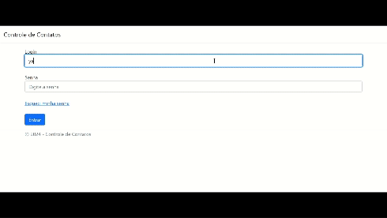

## 💻 Projeto
Esse é um projeto Web de um Sistema de Controle de Contatos.

## 🚀 Tecnologias
Esse projeto foi desenvolvido utilizando:

- ASP.NET MVC
- C#
- SQL Server
- HTML
- BootStrap

## ✨ Funcionalidades
- Listar contatos presentes no Banco de Dados
- Adicionar, editar e remover contatos - com a verificação se as informações são válidas
- Mensagens de sucesso e erro das ações realizadas pelo usuário
- Paginação e filtro de busca de contatos
- Cadastro de usuários, onde:
    - Usuário padrão - acesso limitado ao sistema
    - Usuário    administrador - acesso total
- Login de usuários:
    - Validação e sessão personalizada com o tipo de perfil
    - Controle de acessos por tipo de perfil
- Criptografia de senha do usuário
- Redefinição de senha com envio de e-mail SMTP
- Tela para alterar senha
- Relacionamento entre tabelas Contato e Usuário
    - Usuário só poderá ver os contatos que criou
- Modal utilizando JavaScript (ajax) e CSS para que seja possível ver quantidade de contatos criada por usuários e a lista desses contatos

## 🖱️ Demonstração

    

